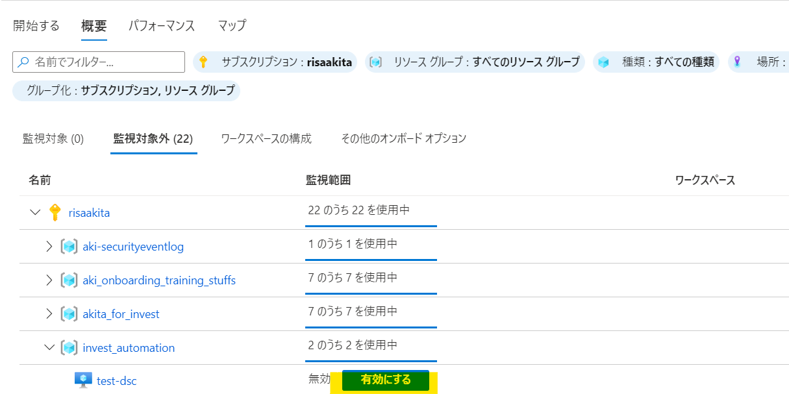
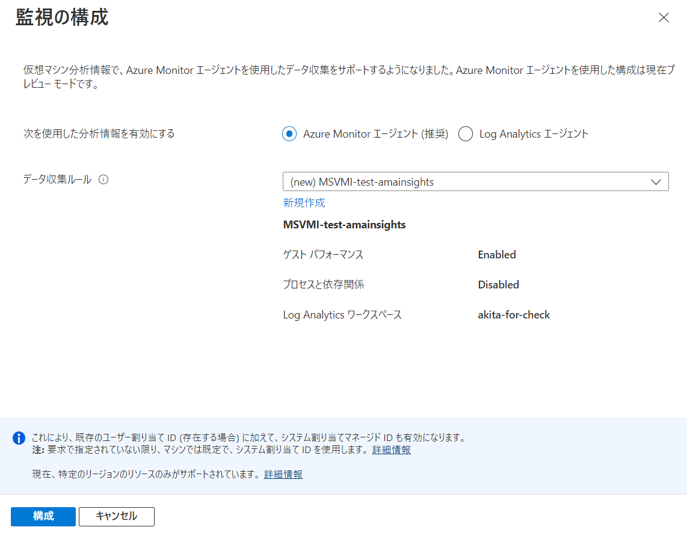
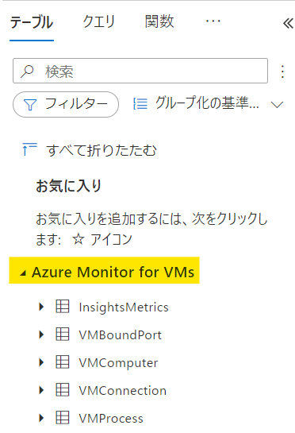

こんにちは！Azure Monitoring チームの秋田です。

本記事は、2022 年 8 月 4 日に米国の Azure Moniotr Blog で公開された、[Announcing preview: Enable Azure Monitor VM insights using Azure Monitor agent](https://techcommunity.microsoft.com/t5/azure-observability-blog/announcing-preview-enable-azure-monitor-vm-insights-using-azure/ba-p/3589423) を翻訳したものになります。
Azure Monitor エージェントを使用した Azuer Monitor VM Insights について、既存の VM insights と比べてどういうところが変わるのか、設定方法などに関して最新情報をお届けします。
<!-- more -->

## 目次
- はじめに
- 既存の VM insigtsh との違い
- 設定方法
  - 現在
  - Azure Monitor VM Insights (preview)
- 導入方法
- VM insights DCRs とは？

## はじめに
本ブログでは、プレビュー段階の機能である Azure Monitor エージェントを使用した Azure Monitor VM Insights の構成についてご紹介します。

## 既存の VM insights との違い
ここでは、現状ご利用いただいております VM insghts と比べてどのようなところが変わるのかをご説明します。
セット アップ面、コスト面、セキュリティとパフォーマンス面で様々な利点があり、これらの利点を享受することがレガシーの Log Analytics エージェントから Azure Monitor エージェントへ移行をする理由の 1 つになります。

### 現在
VM insights は、監視のために VM や VM スケールセットに Log Analytics エージェントと Dependency エージェントの 2 つをインストールする必要があります。

### Azure Monitor VM Insights (preview)
Azure Monitor VM Insights には、レガシーの Log Analytics エージェントから Azure Monitor エージェントにエージェントを交換するだけではなく、
もっと多くの利点があります。
- Centralized configuration (一元化された構成)
データ収集ルール (以下、DCR) を使用して、VM Insights を簡単にセット アップすることが可能です。
Azure ポータルを利用して VM insights を有効化する場合、VM insights を利用するための DCR が存在しない場合は、新たな DCR が構成されます。
同一構成の DCR を複数台の VM に適用する際には、DCR に当該 VM を関連付けするだけで適用することが可能です。

- Optimize costs (最適化されたコスト)
プロセスとマップ ビューを提供する依存関係データを収集するか否かをご選択いただけるように変更しました。
従来は、依存関係データの収集のために Dependency エージェント (依存関係エージェント) が必要でしたが、新しい Azure Monitor VM Insights の構成オプションでは、Dependency エージェントのインストールが不要になりました。これにより、必要な情報だけを収集でき、コストを最適化することが可能になります。

- Enhanced security and performance (セキュリティとパフォーマンスの強化)
Azure Monitor エージェントでは、認証とセキュリティのためにマネージド ID を使用しております。
これらは、レガシーのエージェントで使用していた認証と比べてよりセキュアでハッキングにも強いです。
また、レガシーのエージェントと比べてより高い event-per-second アップロード率を示します。

## 導入方法
Azure ポータルから導入する方法、ARM テンプレートや Azure ポリシーにより導入する方法など様々な方法がありますが、
本ブログでは Azure ポータルから導入する方法をご案内いたします。

注意 : Azure Monitor VM Insights を導入する VM が事前に [開始] されている必要があることにご注意ください。

下記の弊社公開情報に手順が記載されております。
こちらも併せてご参照ください。
Azure Monitor エージェントの VM insights を有効にする
https://learn.microsoft.com/ja-jp/azure/azure-monitor/vm/vminsights-enable-portal#enable-vm-insights-for-azure-monitor-agent

1. Azure のサービスから [モニター] を選択してください。

2. 左端の [分析情報] メニューにあります [仮想マシン] を選択してください。

3. [概要] タブにあります [監視対象外] の VM から監視対象としたい VM を探し、[有効にする] をクリックしてください。  

4. 遷移後の画面で [有効] をクリックしてください。すると、[監視の構成] という画面に遷移します。

5. 手順 4 により遷移した [監視の構成] 画面で各種設定を行います。
[次を使用した分析情報を有効にする] は [Azure Monitor エージェント (推奨)] を選択し、[データ収集ルール] に関しては、DCR 未作成の場合は、[新規作成] により作成してください。
VM insights 用の DCR を既に作成している場合は、プルダウンから利用したい DCR を選択してください。

すべての設定が完了したら、[構成] をクリックしてください。

以上で、Azure Monitor VM insights の導入が完了しました。

(補足) 収集されたログを確認する方法。
収集先として指定した Log Analytics ワークスペースの左端にあります [全般] メニューから [ログ] をクリックしてください。
[Azure Monitor for VMs] に属するテーブルを使用することで、収集されたデータを確認いただくことが可能です。

## VM insights DCRs とは？
| 構成オプション | 説明 |
| ---- | ---- |
|ゲスト パフォーマンス | ゲスト OS からパフォーマンス データを収集するか否かを指定する。 すべてのマシンに対して設定が必要で、パフォーマンス ビューが取得可能。 |
|プロセスと依存関係 | 仮想マシン上で実行中のプロセスとマシン間の依存関係に関する詳細を取得する。 こちらを設定するかは任意であり、設定するとマシンに対して VM insights マップの機能が使用できる。 この機能を使用するよう設定すると、サポートされた OS に Dependency エージェントもインストールされる。 |
|Log Analytics ワークスペース | データの収集先として用いる特定のワークスペース |

上記のユニークな組み合わせにより、DCR が形成されます。

### 注意事項
- VM insights を有効化する際にはこのドキュメントに記載した VM insights 用の DCR の使用を推奨します。既存の DCR を編集して VM insights の機能を使えるようにしようとすると、必要な拡張機能がインストールされなかったり、VM Insights による可視化のために必要なデータ ストリームが構成されない可能性があります。
- Windows や Syslog event のような追加のデータを収集するために既存の VM Insights DCR を編集することは可能ですが、新たな DCR を作成してマシンを関連付けることを推奨します。
- 同一のイベント ID を収集するよう設定している DCR が複数個あったり、1 つの VM を複数の DCR と関連付けたりしていると、データが重複する原因となります。重複を避けるため、DCR により収集するイベントが重複しないよう注意して DCR を作成してください。

既に Log Analytics エージェントにより VM insights を構成済みの場合には、[移行ガイダンス](https://learn.microsoft.com/ja-jp/azure/azure-monitor/vm/vminsights-enable-overview#migrate-from-log-analytics-agent) をご参照いただき、Azure Monitor エージェントへ移行を行ってください。
オンプレミスのマシンに関しましては、 Azure VM と似たプロセスで VM insights が使用できるよう、[Azure Arc for Server](https://learn.microsoft.com/ja-jp/azure/azure-arc/servers/overview) を使用できる状態にすることをお勧めします。

詳細な情報については、[ドキュメント全文](https://learn.microsoft.com/ja-jp/azure/azure-monitor/vm/vminsights-enable-overview) をご確認ください。